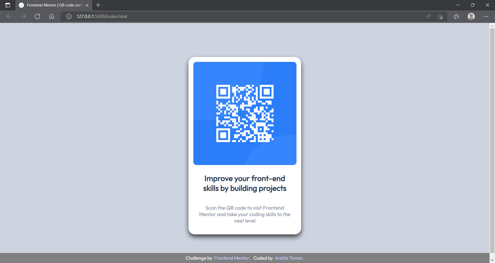

# Frontend Mentor - QR code component solution By Ankita Tomar

This is my first challenge, the solution to the [QR code component challenge on Frontend Mentor](https://www.frontendmentor.io/challenges/qr-code-component-iux_sIO_H). Frontend Mentor challenges help you improve your coding skills by building realistic projects. 

## Table of contents

- [Overview](#overview)
  - [Screenshot](#screenshot)
  - [Links](#links)
- [My process](#my-process)
  - [Built with](#built-with)
  - [What I learned](#what-i-learned)
  - [Continued development](#continued-development)
  - [Useful resources](#useful-resources)
- [Author](#author)

**Note:**

## Overview

### Screenshot

### This is how the card looks in full screen mode on laptop.

### This is how it looks after resizing the window.

### This is how it looks in responsive mobile view

**Note: I'll add the links later**

### Links

- Live Site URL: [First Challenge at Frontend Mentor | QR code component](https://ankita1710.github.io/The_QR_Challenge/)

## My process

### Built with

- Semantic HTML5 markup
- CSS custom properties
- Flexbox
- Tried to add a fluid layout

**Note:**

### What I learned
This is my first challenge attempt and I can say it helped me understand a few things about flexbox, though I won't say I know all the ins and outs now. But It's a start and More challenges to be taken up. 

### Continued development
In future challenges I want to focus more on understanding different ways to design mobile responsive and fluid designs. That's what I would be focusing on. 

### Useful resources

- [ColorHunt](https://colorhunt.co/palettes/fall) - This helped me to look for various color pallete, it is definitely a great help in designing process. 

## Author
- Frontend Mentor - [@ankita1710](https://www.frontendmentor.io/profile/ankita1710)
- LinkedIn - [Ankita Tomar](https://www.linkedin.com/in/ankita-tomar-a284661a7/)

This is my first attempt and It would be great if anyone has any suggestions or resources to help me guide on how to smartly create designs for web. 

Thank you!